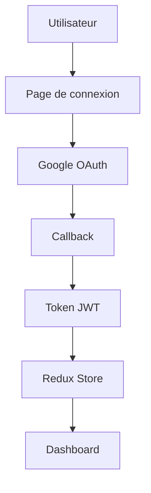

# Architecture du Template Frontend

## 🏗️ Vue d'ensemble

Ce template suit une architecture moderne basée sur Next.js 15 avec l'App Router, organisée selon les principes de séparation des responsabilités et de réutilisabilité.

## 📐 Principes architecturaux

### 1. Séparation des préoccupations
- **Présentation** : Composants UI dans `/components`
- **Logique métier** : Features dans `/features`
- **Données** : Services dans `/services`
- **État global** : Redux dans `/reducers`

### 2. Modularité
- Chaque feature est autonome
- Composants réutilisables
- Hooks personnalisés
- Services découplés

### 3. Scalabilité
- Structure claire et extensible
- Patterns cohérents
- Documentation intégrée
- Tests facilités

## 🗂️ Architecture des dossiers

```
src/
├── app/                    # App Router Next.js
│   └── [locale]/          # Internationalisation
│       ├── layout.tsx     # Layout principal
│       ├── page.tsx       # Page d'accueil
│       ├── auth/          # Routes d'authentification
│       ├── dashboard/     # Routes du dashboard
│       └── ...
├── components/            # Composants réutilisables
│   ├── ui/               # Composants de base (shadcn/ui)
│   ├── auth/             # Composants d'authentification
│   ├── dashboard/        # Composants du dashboard
│   └── sections/         # Sections de pages
├── features/             # Fonctionnalités métier
│   ├── billing/          # Gestion des factures
│   │   ├── components/   # Composants spécifiques
│   │   ├── hooks/        # Hooks métier
│   │   ├── services/     # Services API
│   │   └── index.ts      # Exports publics
│   └── landingChat/      # Chat de landing
├── hooks/                # Hooks globaux
├── i18n/                 # Configuration i18n
├── lib/                  # Utilitaires
├── reducers/             # Redux store
├── services/             # Services globaux
└── types/                # Types TypeScript
```

## 🔄 Flux de données

### 1. État local (useState/useReducer)
```typescript
// Pour l'état local des composants
const [isOpen, setIsOpen] = useState(false);
```

### 2. État global (Redux Toolkit)
```typescript
// Pour l'état partagé entre composants
const user = useSelector((state: RootState) => state.user);
```

### 3. État serveur (React Query/SWR)
```typescript
// Pour les données serveur avec cache
const { data, isLoading } = useQuery(['users'], fetchUsers);
```

### 4. État persistant (Redux Persist)
```typescript
// Pour la persistance des données
const persistedReducer = persistReducer(persistConfig, rootReducer);
```

## 🎨 Architecture UI

### Système de composants

#### 1. Composants de base (shadcn/ui)
```typescript
// Composants primitifs réutilisables
<Button variant="primary" size="lg">
  Action
</Button>
```

#### 2. Composants composites
```typescript
// Assemblage de composants de base
<Card>
  <CardHeader>
    <CardTitle>Titre</CardTitle>
  </CardHeader>
  <CardContent>
    <p>Contenu</p>
  </CardContent>
</Card>
```

#### 3. Composants de page
```typescript
// Composants spécifiques à une page
<DashboardLayout>
  <DashboardContent />
</DashboardLayout>
```

### Système de thème

#### Variables CSS
```css
:root {
  --primary: oklch(0.205 0 0);
  --secondary: oklch(0.97 0 0);
  --background: oklch(1 0 0);
  --foreground: oklch(0.145 0 0);
}
```

#### Classes Tailwind
```typescript
// Utilisation des variables CSS
<div className="bg-background text-foreground">
  <h1 className="text-primary">Titre</h1>
</div>
```

## 🔐 Architecture d'authentification

### Flux d'authentification



### Composants d'authentification

#### 1. ProtectedRoute
```typescript
// Protection des routes
<ProtectedRoute>
  <DashboardContent />
</ProtectedRoute>
```

#### 2. AuthProvider
```typescript
// Contexte d'authentification
<AuthProvider>
  <App />
</AuthProvider>
```

#### 3. Hooks d'authentification
```typescript
// Hook personnalisé
const { user, login, logout, isLoading } = useAuth();
```

## 🌐 Architecture i18n

### Configuration
```typescript
// src/i18n/routing.ts
export const locales = ['fr', 'en'] as const;
export const defaultLocale = 'fr' as const;
```

### Utilisation
```typescript
// Dans les composants
import { useTranslations } from 'next-intl';

const t = useTranslations('common');
return <h1>{t('title')}</h1>;
```

### Structure des traductions
```json
// messages/fr.json
{
  "common": {
    "title": "Mon Application",
    "description": "Description"
  },
  "auth": {
    "login": "Se connecter",
    "logout": "Se déconnecter"
  }
}
```

## 📱 Architecture responsive

### Breakpoints Tailwind
```typescript
// Utilisation des breakpoints
<div className="
  grid 
  grid-cols-1 
  md:grid-cols-2 
  lg:grid-cols-3
">
  {/* Contenu */}
</div>
```

### Navigation mobile
```typescript
// Navigation adaptative
<NavigationMenu className="hidden md:flex">
  {/* Menu desktop */}
</NavigationMenu>
<MobileMenu className="md:hidden">
  {/* Menu mobile */}
</MobileMenu>
```

## 🚀 Architecture de performance

### Optimisations Next.js

#### 1. Images optimisées
```typescript
import Image from 'next/image';

<Image
  src="/hero.jpg"
  alt="Hero"
  width={800}
  height={600}
  priority
/>
```

#### 2. Lazy loading
```typescript
import dynamic from 'next/dynamic';

const HeavyComponent = dynamic(() => import('./HeavyComponent'), {
  loading: () => <p>Chargement...</p>
});
```

#### 3. Code splitting
```typescript
// Séparation automatique par route
// Chaque page est un chunk séparé
```

### Optimisations Redux

#### 1. Sélecteurs mémorisés
```typescript
const selectUser = (state: RootState) => state.user;
const selectUserData = createSelector(
  [selectUser],
  (user) => user.data
);
```

#### 2. Actions asynchrones
```typescript
// Redux Toolkit Query
const api = createApi({
  reducerPath: 'api',
  baseQuery: fetchBaseQuery({
    baseUrl: '/api/',
  }),
  endpoints: (builder) => ({
    getUsers: builder.query<User[], void>({
      query: () => 'users',
    }),
  }),
});
```

## 🧪 Architecture de tests

### Structure des tests
```
__tests__/
├── components/           # Tests de composants
├── features/            # Tests de fonctionnalités
├── services/            # Tests de services
├── utils/               # Tests d'utilitaires
└── __mocks__/           # Mocks globaux
```

### Stratégie de test
1. **Tests unitaires** : Composants isolés
2. **Tests d'intégration** : Interactions entre composants
3. **Tests E2E** : Flux complets utilisateur

## 📦 Architecture de déploiement

### Environnements
- **Development** : `localhost:3000`
- **Staging** : `staging.monapp.com`
- **Production** : `monapp.com`

### Variables d'environnement
```env
# Development
NEXT_PUBLIC_API_URL=http://localhost:8000

# Production
NEXT_PUBLIC_API_URL=https://api.monapp.com
```

### Build et déploiement
```bash
# Build de production
pnpm build

# Déploiement Vercel
vercel --prod
```

## 🔧 Architecture de développement

### Outils de développement
- **ESLint** : Linting du code
- **Prettier** : Formatage du code
- **TypeScript** : Typage statique
- **Husky** : Git hooks

### Workflow Git
```bash
# Feature branch
git checkout -b feature/nouvelle-fonctionnalite

# Commit conventionnel
git commit -m "feat: ajouter nouvelle fonctionnalité"

# Pull request
git push origin feature/nouvelle-fonctionnalite
```

## 📊 Monitoring et analytics

### Métriques de performance
- **Core Web Vitals** : LCP, FID, CLS
- **Bundle size** : Taille des chunks
- **Runtime performance** : Temps de rendu

### Outils de monitoring
- **Vercel Analytics** : Métriques de production
- **Sentry** : Gestion des erreurs
- **Google Analytics** : Analytics utilisateur

## 🔄 Évolutivité

### Ajout de nouvelles features
1. Créer le dossier dans `/features`
2. Définir les types dans `/types`
3. Créer les services dans `/services`
4. Ajouter les composants dans `/components`
5. Configurer les routes dans `/app`

### Refactoring
- **Composants** : Extraire la logique dans des hooks
- **Services** : Séparer les responsabilités
- **Types** : Centraliser les interfaces
- **Tests** : Maintenir la couverture

---

Cette architecture est conçue pour évoluer avec votre projet tout en maintenant la cohérence et la maintenabilité du code.
